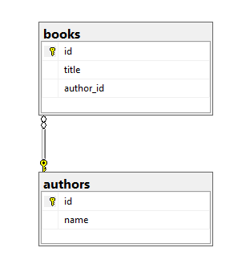

<a id="readme-top"></a>


<!-- PROJECT SHIELDS -->
[![Contributors][contributors-shield]][contributors-url]
[![Forks][forks-shield]][forks-url]
[![Stargazers][stars-shield]][stars-url]
[![Issues][issues-shield]][issues-url]
[![MIT License][license-shield]][license-url]


<!-- PROJECT LOGO -->
<br />
<div align="center">
  <h1>LIBRARYMVC</h1>
</div>


<!-- TABLE OF CONTENTS -->
<details>
  <summary>Tabla de contenidos</summary>
  <ol>
    <li>
      <a href="#acerca-del-proyecto">Acerca del proyecto</a>
      <ul>
        <li><a href="#construido-con-🛠️">Construido con</a></li>
      </ul>
    </li>
    <li>
      <a href="#primeros-pasos-🚀">Primeros pasos</a>
      <ul>
        <li><a href="#prerrequisitos-📋">Prerrequisitos</a></li>
        <li><a href="#instalación-🔧">Instalación</a></li>
        <li><a href="#ejecución-⏯️">Ejecución</a></li>
      </ul>
    </li>
    <li><a href="#diagrama-entidad-relación-📁">Diagrama entidad relación</a></li>
    <li><a href="#autores-✒️">Autores</a></li>
    <li><a href="#licencia-📄">Licencia</a></li>
    <li><a href="#contactos-💬">Contactos</a></li>
  </ol>
</details>


<!-- ABOUT THE PROJECT -->
## Acerca del proyecto


LIBRARYMVC es una aplicación web construida con **ASP.NET Core** y **Entity Framework** que permite gestionar una biblioteca digital de manera eficiente. Con esta plataforma, los usuarios pueden explorar, añadir y administrar libros, así como registrar autores y asociarlos con sus obras.

El proyecto está orientado a brindar una experiencia intuitiva mediante una interfaz basada en Bootstrap, y aprovecha SQL Server como base de datos para garantizar un manejo robusto de la información.

Características principales:
- CRUD completo para libros y autores.
- Relación uno a muchos entre autores y libros.
- Soporte para operaciones SQL con eliminación en cascada.

<p align="right">(<a href="#readme-top">Principio de página</a>)</p>


### Construido con 🛠️

- [![ASP.NET Core][aspnetcore-shield]][aspnetcore-url]
- [![Entity Framework Core][efcore-shield]][efcore-url]
- [![SQL Server][sqlserver-shield]][sqlserver-url]
- [![Bootstrap][bootstrap-shield]][bootstrap-url]

<p align="right">(<a href="#readme-top">Principio de página</a>)</p>


<!-- GETTING STARTED -->
## Primeros pasos 🚀

Sigue los pasos para configurar y ejecutar el proyecto en tu máquina local.

### Prerrequisitos 📋

- **Sistema Operativo**: Windows 10 o superior.

- **Visual Studio**: 2022 (con soporte para ASP.NET Core y Entity Framework)

- **SQL Server**: Instalado y corriendo localmente.

- **SQL Server Management Studio**: Gestionar y administrar bases de datos SQL.

- **.NET SDK**: Versión 8.0 o superior.

- **Git**: Instalado para clonar el repositorio.

### Instalación 🔧

1. Clona el repositorio.

  ```sh
  git clone https://github.com/JhonFabioEC/LIBRARYMVC.git
  ```

2. Abre el proyecto en `Visual Studio 2022`.

3. Restaura los paquetes NuGet del proyecto:

- Puedes hacer esto desde Visual Studio a través del menú `Herramientas` -> `Administrador de paquetes NuGet` -> `Consola del Administrador de paquetes` y ejecutando:

  ```sh
  Update-Package
  ```

4. Ejecuta el script de la base de datos:

- Abre `SQL Server Management Studio` o el cliente que prefieras para gestionar SQL Server.

- Conéctate a tu instancia de SQL Server.

- Ejecuta el siguiente script para crear una nueva base de datos (por ejemplo, `dbLibraryMVC`):

  ```sql
  create database dbLibraryMVC;
  ```

- Ejecuta el siguiente script para utilizar la base de datos creada:

  ```sql
  use dbLibraryMVC;
  ```

- Ejecuta el siguiente script para crear las tablas:
  ```sql
  create table authors(
    id int identity(1,1) primary key,
    name varchar(60)
  );

  create table books(
    id int identity(1,1) primary key,
    title varchar(60),
    author_id int,
    CONSTRAINT FK_authors FOREIGN KEY (author_id) REFERENCES authors(id) ON DELETE CASCADE
  );
  ```

5. Configura la conexión a SQL Server:

- Ve al archivo `appsettings.json` y asegúrate de configurar la cadena de conexión correctamente:

  ```json
  "ConnectionStrings": {
    "connection": "server=localhost; database=dbLibraryMVC; integrated security=true; Encrypt=False;"
  }
  ```

### Ejecución ⏯️

1. Ejecuta la aplicación desde Visual Studio:

- Presiona `F5` o selecciona `Depurar` → `Iniciar sin depurar`.

<p align="right">(<a href="#readme-top">Principio de página</a>)</p>


<!-- ENTITY RELATIONSHIP DIAGRAM -->
## Diagrama entidad relación 📁



<p align="right">(<a href="#readme-top">Principio de página</a>)</p>


<!-- AUTHOR -->
## Autores ✒️

- **Jhon Favio España Cortes** - [JhonFabioEC](https://github.com/JhonFabioEC)

<p align="right">(<a href="#readme-top">Principio de página</a>)</p>


<!-- LICENSE -->
## Licencia 📄

Este proyecto está bajo la Licencia MIT - ve el archivo `LICENSE` para detalles.

<p align="right">(<a href="#readme-top">Principio de página</a>)</p>


<!-- CONTACTS -->
## Contactos 💬

Jhon Favio España Cortes - [@jhonydev404](https://www.linkedin.com/in/jhonydev404/) - jhonnycan212@gmail.com

<p align="right">(<a href="#readme-top">Principio de página</a>)</p>


<!-- MARKDOWN LINKS & IMAGES -->
[contributors-shield]: https://img.shields.io/github/contributors/JhonFabioEC/LIBRARYMVC.svg?style=for-the-badge
[contributors-url]: https://github.com/JhonFabioEC/LIBRARYMVC/graphs/contributors

[forks-shield]: https://img.shields.io/github/forks/JhonFabioEC/LIBRARYMVC.svg?style=for-the-badge
[forks-url]: https://github.com/JhonFabioEC/LIBRARYMVC/network/members

[stars-shield]: https://img.shields.io/github/stars/JhonFabioEC/LIBRARYMVC.svg?style=for-the-badge
[stars-url]: https://github.com/JhonFabioEC/LIBRARYMVC/stargazers

[issues-shield]: https://img.shields.io/github/issues/JhonFabioEC/LIBRARYMVC.svg?style=for-the-badge
[issues-url]: https://github.com/JhonFabioEC/LIBRARYMVC/issues

[license-shield]: https://img.shields.io/github/license/JhonFabioEC/LIBRARYMVC.svg?style=for-the-badge
[license-url]: https://github.com/JhonFabioEC/LIBRARYMVC/blob/master/LICENSE.txt

[aspnetcore-shield]: https://img.shields.io/badge/ASP.NET_Core-512BD4?style=for-the-badge&logo=dotnet&logoColor=white
[aspnetcore-url]: https://dotnet.microsoft.com/apps/aspnet

[efcore-shield]: https://img.shields.io/badge/Entity_Framework_Core-512BD4?style=for-the-badge&logo=efcore&logoColor=white
[efcore-url]: https://docs.microsoft.com/en-us/ef/core/

[sqlserver-shield]: https://img.shields.io/badge/SQL_Server-CC2927?style=for-the-badge&logo=microsoft-sql-server&logoColor=white
[sqlserver-url]: https://www.microsoft.com/en-us/sql-server

[bootstrap-shield]: https://img.shields.io/badge/Bootstrap-563D7C?style=for-the-badge&logo=bootstrap&logoColor=white
[bootstrap-url]: https://getbootstrap.com